# 📋 a30\_30\_rag\_search.py 設計書

## 📝 目次

1. [📖 概要書](https://claude.ai/chat/c7a72c78-2565-409b-bfb2-aa95b7532798#%F0%9F%93%96-%E6%A6%82%E8%A6%81%E6%9B%B8)
2. [🔧 システム構成](https://claude.ai/chat/c7a72c78-2565-409b-bfb2-aa95b7532798#%F0%9F%94%A7-%E3%82%B7%E3%82%B9%E3%83%86%E3%83%A0%E6%A7%8B%E6%88%90)
3. [📋 関数一覧](https://claude.ai/chat/c7a72c78-2565-409b-bfb2-aa95b7532798#%F0%9F%93%8B-%E9%96%A2%E6%95%B0%E4%B8%80%E8%A6%A7)
4. [📑 関数詳細設計](https://claude.ai/chat/c7a72c78-2565-409b-bfb2-aa95b7532798#%F0%9F%93%91-%E9%96%A2%E6%95%B0%E8%A9%B3%E7%B4%B0%E8%A8%AD%E8%A8%88)
5. [⚙️ 技術仕様](https://claude.ai/chat/c7a72c78-2565-409b-bfb2-aa95b7532798#%E2%9A%99%EF%B8%8F-%E6%8A%80%E8%A1%93%E4%BB%95%E6%A7%98)
6. [🚨 エラーハンドリング](https://claude.ai/chat/c7a72c78-2565-409b-bfb2-aa95b7532798#%F0%9F%9A%A8-%E3%82%A8%E3%83%A9%E3%83%BC%E3%83%8F%E3%83%B3%E3%83%89%E3%83%AA%E3%83%B3%E3%82%B0)

---

## 📖 概要書

### 🎯 処理の概要

**最新OpenAI Responses API + file\_search RAG検索システム**

本アプリケーションは、OpenAIの最新Responses APIとfile\_searchツールを活用した次世代RAG（Retrieval-Augmented Generation）検索システムです。複数のVector Storeから高精度な情報検索を行い、ファイル引用付きの回答を提供します。

#### 🌟 主要機能


| 機能                       | 説明                              |
| -------------------------- | --------------------------------- |
| 🤖**最新Responses API**    | OpenAI最新APIによる高品質回答生成 |
| 🔍**file\_search ツール**  | Vector Store統合検索機能          |
| 📚**複数Vector Store対応** | 4種類の専門知識ベース             |
| 📋**ファイル引用表示**     | 検索結果の出典明示                |
| 🌐**多言語対応**           | 英語・日本語質問サポート          |
| 📊**検索オプション**       | カスタマイズ可能な検索設定        |
| 🕒**履歴管理**             | 検索履歴の保存・再実行            |
| 🔒**セキュア設計**         | 環境変数でのAPIキー管理           |

#### 🗃️ 対応Vector Store

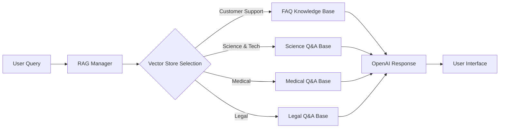

### 🔄 mainの処理の流れ

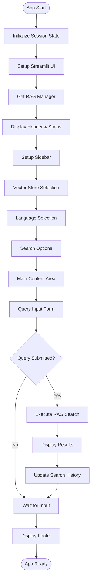

---

## 🔧 システム構成

### 📦 主要コンポーネント

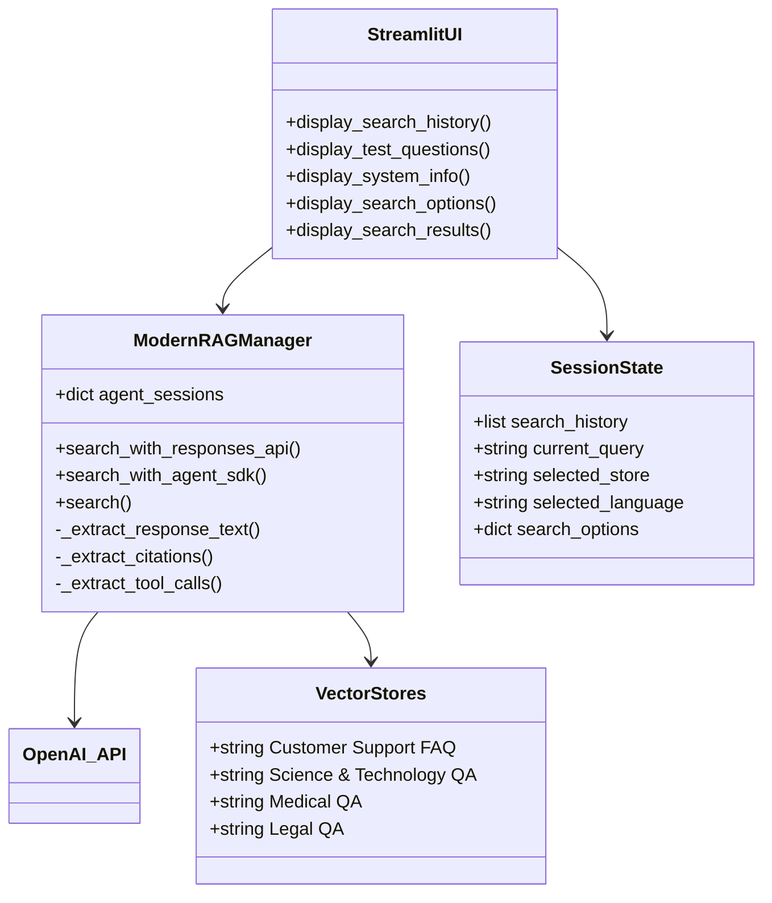

### 📋 データフロー

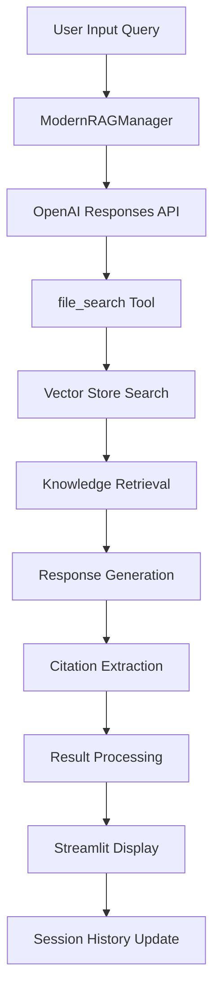

---

## 📋 関数一覧

### 🏗️ 初期化・設定関数


| 関数名                       | 分類          | 処理概要                        | 重要度 |
| ---------------------------- | ------------- | ------------------------------- | ------ |
| `initialize_session_state()` | 🔧 初期化     | Streamlitセッション状態初期化   | ⭐⭐⭐ |
| `get_rag_manager()`          | 🏭 ファクトリ | RAGマネージャーシングルトン取得 | ⭐⭐⭐ |
| `get_selected_store_index()` | 🔍 検索       | Vector Storeインデックス取得    | ⭐⭐   |

### 🤖 RAG処理関数


| 関数名                        | 分類        | 処理概要              | 重要度 |
| ----------------------------- | ----------- | --------------------- | ------ |
| `ModernRAGManager.__init__()` | 🏗️ 初期化 | RAGマネージャー初期化 | ⭐⭐⭐ |
| `search_with_responses_api()` | 🔍 検索     | Responses API検索実行 | ⭐⭐⭐ |
| `search_with_agent_sdk()`     | 🤖 Agent    | Agent SDK検索実行     | ⭐⭐   |
| `search()`                    | 🎯 統合     | 統合検索メソッド      | ⭐⭐⭐ |

### 🔧 データ抽出関数


| 関数名                     | 分類    | 処理概要               | 重要度 |
| -------------------------- | ------- | ---------------------- | ------ |
| `_extract_response_text()` | 📝 抽出 | レスポンステキスト抽出 | ⭐⭐⭐ |
| `_extract_citations()`     | 📚 抽出 | ファイル引用情報抽出   | ⭐⭐⭐ |
| `_extract_tool_calls()`    | 🔧 抽出 | ツール呼び出し情報抽出 | ⭐⭐   |

### 🎨 UI表示関数


| 関数名                     | 分類      | 処理概要           | 重要度 |
| -------------------------- | --------- | ------------------ | ------ |
| `display_search_history()` | 📊 履歴   | 検索履歴表示       | ⭐⭐   |
| `display_test_questions()` | 💡 質問   | テスト質問表示     | ⭐⭐   |
| `display_system_info()`    | ℹ️ 情報 | システム情報表示   | ⭐     |
| `display_search_options()` | ⚙️ 設定 | 検索オプション表示 | ⭐⭐   |
| `display_search_results()` | 📈 結果   | 検索結果表示       | ⭐⭐⭐ |

### 🎯 メイン制御関数


| 関数名   | 分類    | 処理概要                   | 重要度 |
| -------- | ------- | -------------------------- | ------ |
| `main()` | 🎯 制御 | アプリケーションメイン制御 | ⭐⭐⭐ |

---

## 📑 関数詳細設計

### 🤖 ModernRAGManager.**init**()

#### 🎯 処理概要

RAGマネージャーの初期化とAgent SDKセッション辞書の準備

#### 📊 処理の流れ

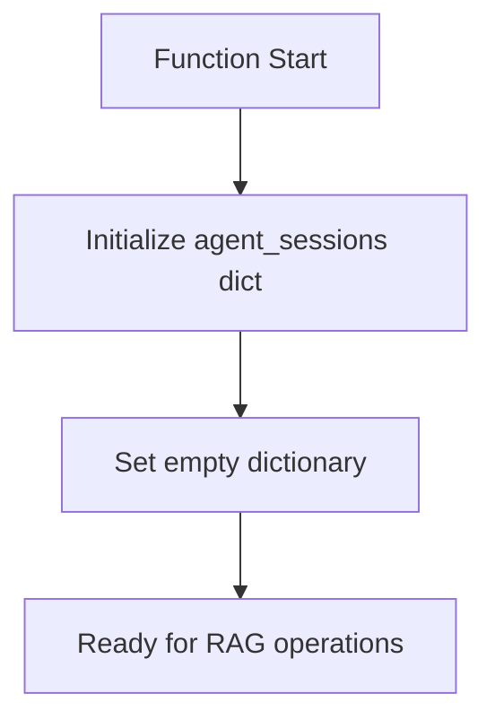

#### 📋 IPO設計


| 項目        | 内容                                 |
| ----------- | ------------------------------------ |
| **INPUT**   | なし                                 |
| **PROCESS** | Agent SDK用セッション辞書の初期化    |
| **OUTPUT**  | なし（副作用：インスタンス状態設定） |

---

### 🔍 ModernRAGManager.search\_with\_responses\_api()

#### 🎯 処理概要

OpenAI Responses API + file\_searchツールによる高精度Vector Store検索

#### 📊 処理の流れ

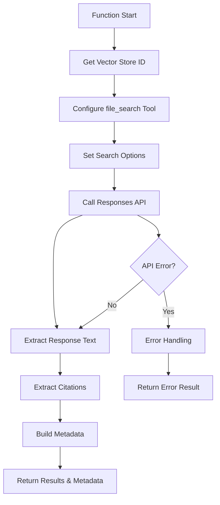

#### 📋 IPO設計


| 項目        | 内容                                                     |
| ----------- | -------------------------------------------------------- |
| **INPUT**   | `query: str`,`store_name: str`,`**kwargs`                |
| **PROCESS** | API呼び出し → レスポンス処理 → メタデータ構築          |
| **OUTPUT**  | `Tuple[str, Dict[str, Any]]`- (回答テキスト, メタデータ) |

#### 🔧 file\_searchツール設定

```python
file_search_tool_dict = {
    "type": "file_search",
    "vector_store_ids": [store_id],
    "max_num_results": max_results,  # オプション
    "filters": filters               # オプション
}
```

#### 📊 生成されるメタデータ例

```json
{
    "store_name": "Medical Q&A",
    "store_id": "vs_687a060f9ed881918b213bfdeab8241b",
    "query": "What are symptoms of diabetes?",
    "timestamp": "2025-01-17T10:30:45",
    "model": "gpt-4o-mini",
    "method": "responses_api_file_search",
    "citations": [
        {
            "file_id": "file_abc123",
            "filename": "medical_qa.txt",
            "index": 0
        }
    ],
    "usage": {
        "prompt_tokens": 150,
        "completion_tokens": 300,
        "total_tokens": 450
    }
}
```

---

### 🤖 ModernRAGManager.search\_with\_agent\_sdk()

#### 🎯 処理概要

Agent SDKによるセッション管理付き検索（簡易版実装）

#### 📊 処理の流れ

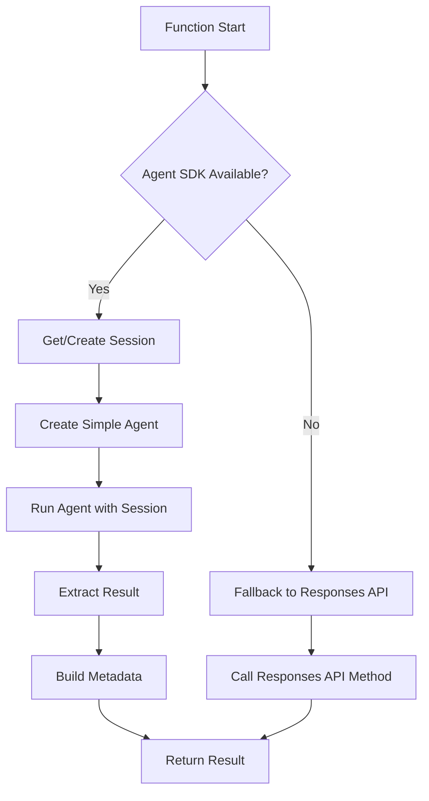

#### 📋 IPO設計


| 項目        | 内容                                                     |
| ----------- | -------------------------------------------------------- |
| **INPUT**   | `query: str`,`store_name: str`                           |
| **PROCESS** | セッション管理 → Agent実行 → 結果抽出                  |
| **OUTPUT**  | `Tuple[str, Dict[str, Any]]`- (回答テキスト, メタデータ) |

#### ⚠️ 注意点

* 現在は簡易版実装
* 実際のRAG機能はResponses APIに委譲
* セッション管理の利点のみ提供

---

### 🎯 ModernRAGManager.search()

#### 🎯 処理概要

統合検索メソッド（Responses API / Agent SDK の選択実行）

#### 📊 処理の流れ

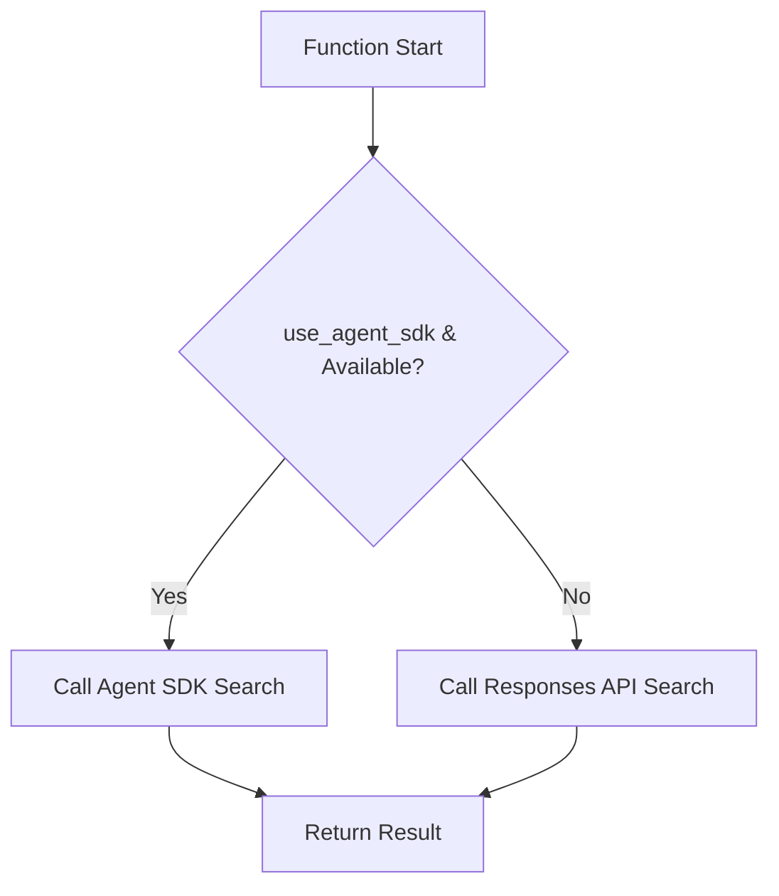

#### 📋 IPO設計


| 項目        | 内容                                                            |
| ----------- | --------------------------------------------------------------- |
| **INPUT**   | `query: str`,`store_name: str`,`use_agent_sdk: bool`,`**kwargs` |
| **PROCESS** | 検索方法選択 → 該当メソッド実行                                |
| **OUTPUT**  | `Tuple[str, Dict[str, Any]]`- (回答テキスト, メタデータ)        |

---

### 📝 ModernRAGManager.\_extract\_response\_text()

#### 🎯 処理概要

OpenAI Responses APIレスポンスからテキスト部分を安全に抽出

#### 📊 処理の流れ

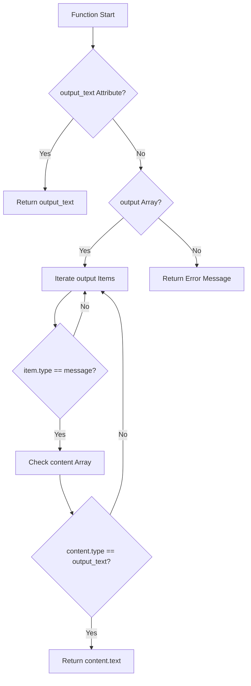

#### 📋 IPO設計


| 項目        | 内容                                                   |
| ----------- | ------------------------------------------------------ |
| **INPUT**   | `response`- OpenAI Responses APIレスポンスオブジェクト |
| **PROCESS** | レスポンス構造解析 → テキスト抽出                     |
| **OUTPUT**  | `str`- 抽出されたレスポンステキスト                    |

---

### 📚 ModernRAGManager.\_extract\_citations()

#### 🎯 処理概要

レスポンスからファイル引用情報を抽出してリスト化

#### 📊 処理の流れ

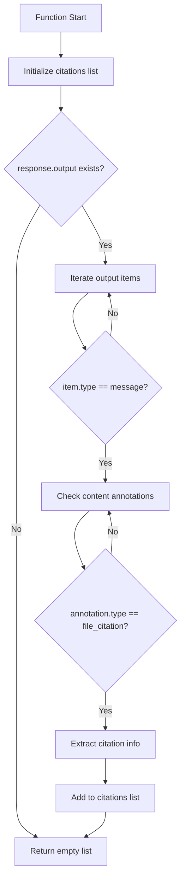

#### 📋 IPO設計


| 項目        | 内容                                                   |
| ----------- | ------------------------------------------------------ |
| **INPUT**   | `response`- OpenAI Responses APIレスポンスオブジェクト |
| **PROCESS** | アノテーション解析 → ファイル引用抽出                 |
| **OUTPUT**  | `List[Dict[str, Any]]`- 引用情報リスト                 |

#### 📄 引用情報構造

```python
citation_example = {
    "file_id": "file_abc123def456",
    "filename": "medical_qa.txt", 
    "index": 0
}
```

---

### 🎨 display\_search\_results()

#### 🎯 処理概要

検索結果の包括的表示（回答・引用・メタデータ）

#### 📊 処理の流れ

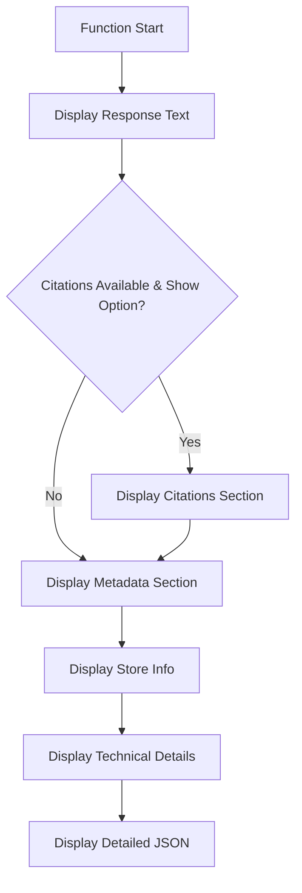

#### 📋 IPO設計


| 項目        | 内容                                            |
| ----------- | ----------------------------------------------- |
| **INPUT**   | `response_text: str`,`metadata: Dict[str, Any]` |
| **PROCESS** | Streamlit UI要素生成 → 段階的情報表示          |
| **OUTPUT**  | なし（副作用：UI表示）                          |

#### 🎨 表示セクション


| セクション          | 内容                           |
| ------------------- | ------------------------------ |
| **🤖 回答**         | AI生成レスポンステキスト       |
| **📚 引用ファイル** | 参照されたファイル一覧         |
| **📊 検索情報**     | Vector Store・モデル・実行時間 |
| **🔍 詳細情報**     | 完全なメタデータJSON           |

---

### 💡 display\_test\_questions()

#### 🎯 処理概要

選択されたVector Storeと言語に応じたテスト質問の動的表示

#### 📊 処理の流れ

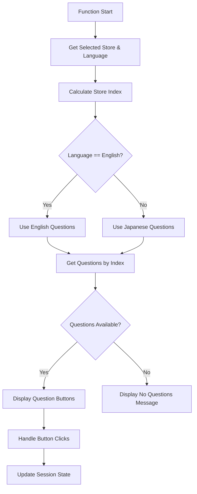

#### 📋 IPO設計


| 項目        | 内容                                              |
| ----------- | ------------------------------------------------- |
| **INPUT**   | なし（セッション状態から取得）                    |
| **PROCESS** | Store・言語マッピング → 質問表示 → クリック処理 |
| **OUTPUT**  | なし（副作用：UI表示・セッション更新）            |

#### 🌐 質問マッピング

```python
# Vector Store対応表
VECTOR_STORE_LIST = [
    "Customer Support FAQ",      # index: 0
    "Science & Technology Q&A",  # index: 1  
    "Medical Q&A",               # index: 2
    "Legal Q&A"                  # index: 3
]

# 質問配列（言語別）
test_q_en[store_index]  # 英語質問
test_q_ja[store_index]  # 日本語質問
```

---

### 🔧 initialize\_session\_state()

#### 🎯 処理概要

Streamlitセッション状態の安全な初期化とデフォルト値設定

#### 📊 処理の流れ

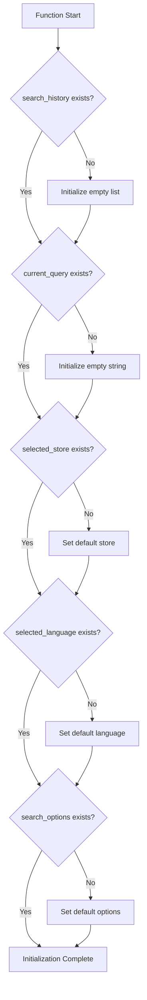

#### 📋 IPO設計


| 項目        | 内容                                     |
| ----------- | ---------------------------------------- |
| **INPUT**   | なし                                     |
| **PROCESS** | セッション状態存在確認 → 未存在時初期化 |
| **OUTPUT**  | なし（副作用：`st.session_state`更新）   |

#### ⚙️ デフォルト値

```python
default_values = {
    "search_history": [],
    "current_query": "",
    "selected_store": "Customer Support FAQ",
    "selected_language": "English",  # RAGデータ最適化
    "use_agent_sdk": False,
    "search_options": {
        "max_results": 20,
        "include_results": True,
        "show_citations": True
    }
}
```

---

### 🎯 main()

#### 🎯 処理概要

RAG検索アプリケーション全体のオーケストレーション

#### 📊 処理の流れ

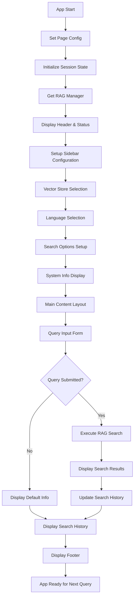

#### 📋 IPO設計


| 項目        | 内容                                               |
| ----------- | -------------------------------------------------- |
| **INPUT**   | なし（Streamlitアプリとして起動）                  |
| **PROCESS** | 全体UI構築 → 設定管理 → 検索実行制御 → 結果表示 |
| **OUTPUT**  | なし（副作用：Streamlit Webアプリ表示）            |

#### 🎨 UIレイアウト

```python
# サイドバー構成
sidebar_sections = [
    "Vector Store Selection",
    "Language Selection", 
    "Search Options",
    "System Information",
    "Test Questions"
]

# メインコンテンツ構成
main_sections = [
    "Header & API Status",
    "Query Input Form", 
    "Search Results Display",
    "Search History",
    "Footer Information"
]
```

---

## ⚙️ 技術仕様

### 📦 依存ライブラリ


| ライブラリ      | バージョン | 用途                         | 重要度 |
| --------------- | ---------- | ---------------------------- | ------ |
| `streamlit`     | 最新       | 🎨 Web UIフレームワーク      | ⭐⭐⭐ |
| `openai`        | 1.x+       | ☁️ OpenAI API クライアント | ⭐⭐⭐ |
| `openai-agents` | 最新       | 🤖 Agent SDK（オプション）   | ⭐⭐   |
| `logging`       | 標準       | 📝 ログ管理                  | ⭐⭐   |
| `typing`        | 標準       | 🔤 型ヒント                  | ⭐⭐   |
| `datetime`      | 標準       | ⏰ 時刻処理                  | ⭐⭐   |
| `json`          | 標準       | 📄 JSON処理                  | ⭐⭐   |
| `pathlib`       | 標準       | 📁 パス操作                  | ⭐     |

### 🗃️ Vector Store設定

#### 📊 登録Vector Store

```yaml
Vector_Stores:
  Customer Support FAQ:
    id: "vs_687a0604f1508191aaf416d88e266ab7"
    description: "カスタマーサポート・FAQ知識ベース"
    optimal_language: "英語"
  
  Science & Technology QA:
    id: "vs_687a061acc908191af7d5d9ba623470b"
    description: "科学技術質問回答知識ベース"
    optimal_language: "英語"
  
  Medical QA:
    id: "vs_687a060f9ed881918b213bfdeab8241b"
    description: "医療質問回答知識ベース" 
    optimal_language: "英語"
  
  Legal QA:
    id: "vs_687a062418ec8191872efdbf8f554836"
    description: "法律質問回答知識ベース"
    optimal_language: "英語"
```

### 🔧 API設定パラメータ

#### 🤖 Responses API設定

```python
responses_api_config = {
    "model": "gpt-4o-mini",
    "tools": [{
        "type": "file_search",
        "vector_store_ids": ["vs_xxx..."],
        "max_num_results": 20,     # 可変
        "filters": None            # オプション
    }],
    "include": ["file_search_call.results"],
    "timeout": 30,
    "max_retries": 3
}
```

#### 🤖 Agent SDK設定

```python
agent_config = {
    "name": "RAG_Agent_{store_name}",
    "model": "gpt-4o-mini", 
    "instructions": "専門分野特化指示",
    "session_type": "SQLiteSession",
    "session_management": True
}
```

### 📊 検索オプション


| オプション           | デフォルト値 | 説明                           |
| -------------------- | ------------ | ------------------------------ |
| **max\_results**     | 20           | Vector Store検索最大結果数     |
| **include\_results** | True         | file\_search\_call.results含有 |
| **show\_citations**  | True         | ファイル引用表示               |
| **use\_agent\_sdk**  | False        | Agent SDK使用フラグ            |

### 🌐 多言語対応

#### 📝 質問言語サポート

```python
language_support = {
    "English": {
        "code": "en",
        "optimization": "RAG Data Optimized",
        "question_sets": 4,
        "total_questions": 20
    },
    "日本語": {
        "code": "ja", 
        "optimization": "Translation Layer",
        "question_sets": 4,
        "total_questions": 20
    }
}
```

### 🔄 セッション管理

#### 💾 セッション状態構造

```python
session_structure = {
    "search_history": [
        {
            "query": "user question",
            "store_name": "Vector Store name",
            "timestamp": "2025-01-17 10:30:45",
            "method": "responses_api_file_search",
            "citations": [{"file_id": "...", "filename": "..."}],
            "result_preview": "first 200 chars..."
        }
    ],
    "current_query": "current input",
    "selected_store": "store name",
    "selected_language": "language code", 
    "search_options": {
        "max_results": 20,
        "include_results": True,
        "show_citations": True
    }
}
```

---

## 🚨 エラーハンドリング

### 🔑 API関連エラー


| エラー種別           | 原因                     | 対処法                         | 影響度 |
| -------------------- | ------------------------ | ------------------------------ | ------ |
| **APIキー未設定**    | 🚫 環境変数未設定        | 設定手順表示・アプリ停止       | 🔴 高  |
| **API認証エラー**    | 🔑 不正なAPIキー         | キー確認指示・再設定案内       | 🔴 高  |
| **API呼び出し失敗**  | 🌐 ネットワーク・API障害 | エラーメッセージ・リトライ提案 | 🟡 中  |
| **レート制限エラー** | ⏱️ 使用量上限到達      | 待機指示・使用量確認案内       | 🟡 中  |

### 🗃️ Vector Store関連エラー


| エラー種別               | 原因                  | 対処法                    | 影響度 |
| ------------------------ | --------------------- | ------------------------- | ------ |
| **Vector Store未見つけ** | 🚫 不正なStore ID     | ID確認・再設定指示        | 🔴 高  |
| **検索結果ゼロ**         | 🔍 該当データなし     | 質問変更提案・他Store提案 | 🟠 低  |
| **ファイル引用取得失敗** | 📚 レスポンス構造変更 | 警告表示・機能継続        | 🟡 中  |

### 🎨 UI関連エラー


| エラー種別             | 原因              | 対処法                   | 影響度 |
| ---------------------- | ----------------- | ------------------------ | ------ |
| **セッション状態破損** | 💾 データ不整合   | 状態リセット・再初期化   | 🟡 中  |
| **履歴表示エラー**     | 📊 データ形式不正 | エラースキップ・継続表示 | 🟠 低  |
| **言語切替エラー**     | 🌐 設定不整合     | デフォルト言語復帰       | 🟠 低  |

### 🤖 Agent SDK関連エラー


| エラー種別             | 原因              | 対処法                      | 影響度 |
| ---------------------- | ----------------- | --------------------------- | ------ |
| **SDK未インストール**  | 📦 ライブラリ不在 | Responses APIフォールバック | 🟠 低  |
| **セッション作成失敗** | 💾 SQLite問題     | 通常検索に切替              | 🟡 中  |
| **Agent実行エラー**    | 🤖 Agent設定問題  | Responses APIフォールバック | 🟡 中  |

### 🛠️ エラー処理フロー

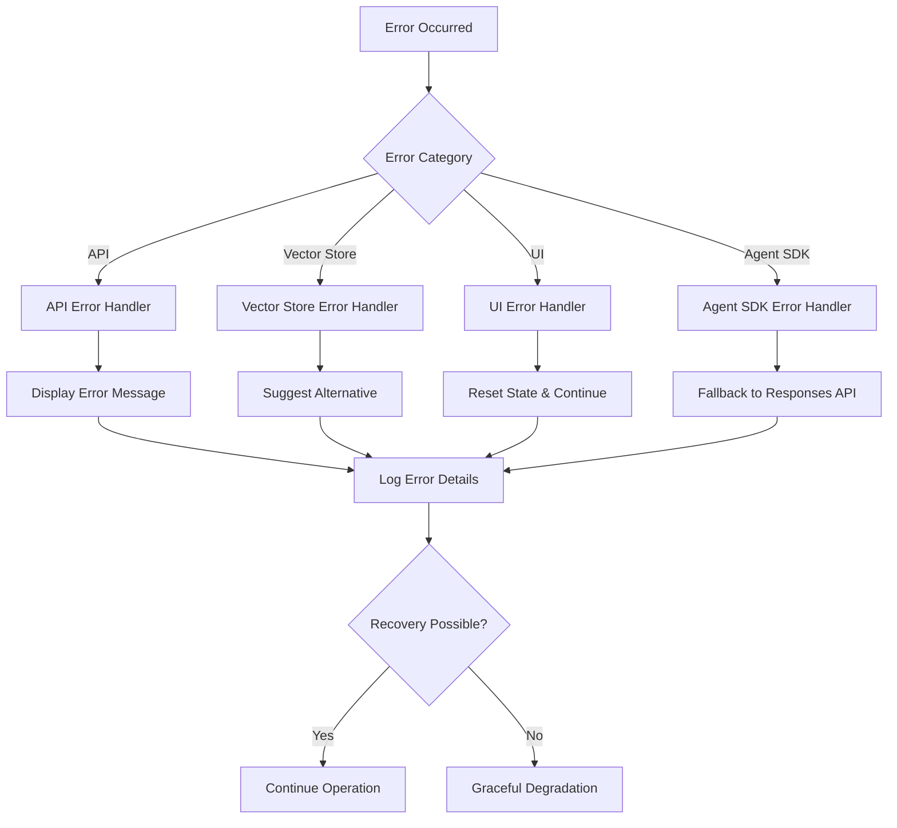

### ✅ エラーメッセージ設計

#### 🎯 適切なエラー通知

```python
# API設定エラー
st.error("OpenAI API キーの設定に問題があります")
st.error("環境変数 OPENAI_API_KEY が設定されているか確認してください")
st.code("export OPENAI_API_KEY='your-api-key-here'")

# 検索エラー  
st.warning("検索結果が見つかりませんでした。質問を変更してみてください")
st.info("💡 他のVector Storeでの検索も試してみてください")

# フォールバック通知
st.info("Agent SDKが利用できないため、Responses APIを使用します")
```

#### ❌ 避けるべきエラーパターン

```python
# 👎 不親切な例
st.error("エラー")                    # 原因不明
st.error("処理失敗")                  # 対処法なし
st.error("internal error")         # 技術的すぎ
```

---

## 🎉 まとめ

この設計書は、**a30\_30\_rag\_search.py** の完全な技術仕様と実装詳細を網羅した包括的ドキュメントです。

### 🌟 設計のハイライト

* **🤖 最新API活用**: OpenAI Responses API + file\_search の完全統合
* **🗃️ 多重Vector Store**: 4つの専門知識ベースによる包括的検索
* **🌐 多言語対応**: 英語最適化 + 日本語サポート
* **📚 引用機能**: 検索結果の出典明示による信頼性向上
* **🔒 セキュア設計**: 環境変数によるAPIキー管理
* **🎨 直感的UI**: StreamlitによるモダンWebインターフェース

### 📈 技術的特徴

* **型安全実装**: 完全な型ヒント + エラー回避
* **フォールバック機能**: Agent SDK → Responses API 自動切替
* **エラー耐性**: 包括的エラーハンドリング
* **セッション管理**: 検索履歴・設定の永続化
* **カスタマイズ性**: 豊富な検索オプション

### 🚀 今後の拡張可能性

* 🌍 多言語Vector Store対応
* 📊 高度な分析ダッシュボード
* 🤖 カスタムAgent作成機能
* 🔄 バッチ検索処理
* 📈 検索品質メトリクス
